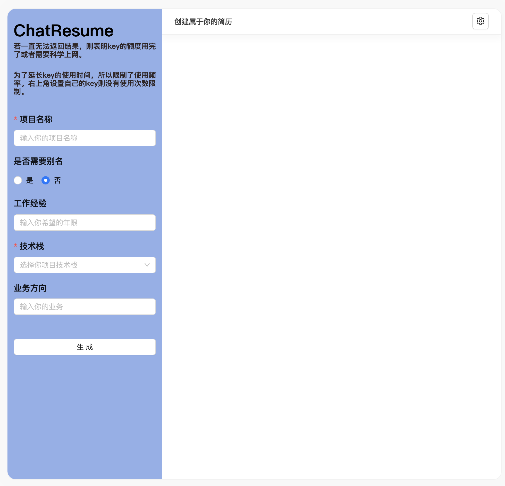

<div align="center">

<h1 align="center">ChatGPT Resume Web</h1>

一键免费部署你的私人 ChatGPT 简历网页应用。

[演示 Demo](https://chat-resume.vercel.app/) / [联系作者](https://raw.githubusercontent.com/calmound/chat-resume/main/public/wechat.png)



</div>

## 主要功能

- 在 1 分钟内使用 Vercel **免费一键部署**
- 支持通过项目的名称，技术栈，工作年限，业务方向关键词，生成简历的项目

## 使用

1. 准备好你的 [OpenAI API Key](https://platform.openai.com/account/api-keys);
2. 点击按钮开始部署：
   [](https://vercel.com/new/clone?repository-url=https%3A%2F%2Fgithub.com%2FYidadaa%2FChatGPT-Next-Web&env=OPENAI_API_KEY&project-name=chatgpt-next-web&repository-name=ChatGPT-Next-Web)，直接使用 Github 账号登陆即可，记得在环境变量页填入 API Key；
3. 部署完毕后，即可开始使用；

## 开发 Development

在开始写代码之前，需要在项目根目录复制.env.example，修改命名 `.env` 文件，里面填入环境变量：

```
OPENAI_API_KEY=<your api key here>
```

### 本地开发 Local Development

> 目前本项目需要科学上网才可以正常访问，具体方式自行解决。有 chatgpt 账号后，通过 [官网](https://platform.openai.com) 拿到 api key

1. 执行 `npm install && npm run dev` 即可。

## 说明

本项目的演示地址所用的 OpenAI 账户的免费额度将于 将于 5 月过期。
